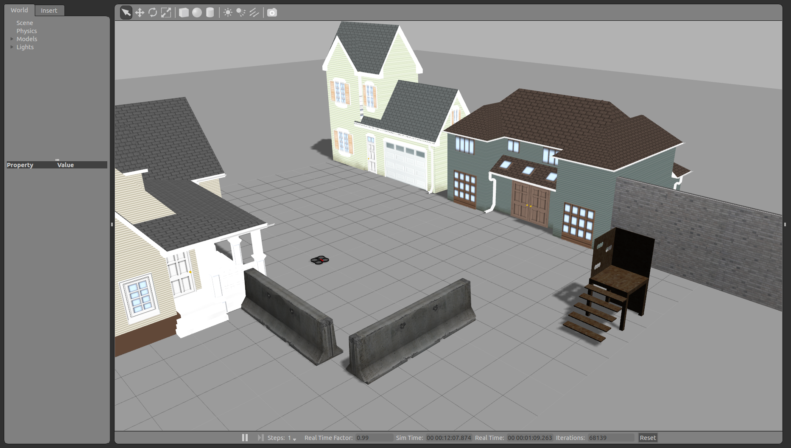
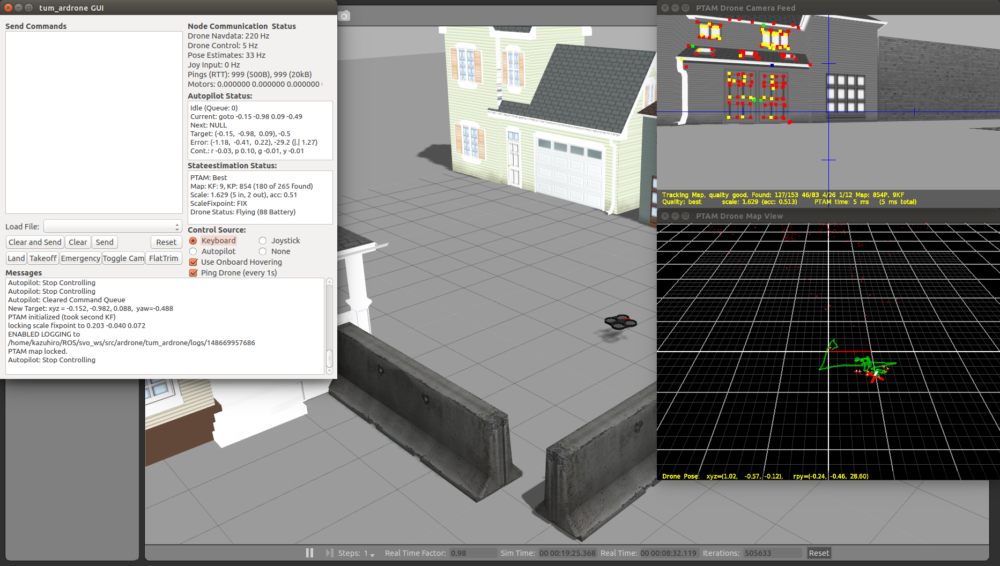

# 概要

Parrot社のAR.droneを使った研究をするための開発環境の構築

## Installation

```bash
git clone git@github.com:lancer-evolution/ardrone.git
cd ~/catkin_ws
rosdep install -i --from-paths src
catkin_make
```
##### エラー対処

* -lglut的なエラー
```bash
sudo apt-get install freeglut3-dev
```
* その他.........

## Run Simulator

tum_simulator
```bash
roslaunch cvg_sim_gazebo ardrone_testworld.launch
```


## Run Driver

For AR.drone
```bash
roslaunch tum_ardrone ardrone_driver.launch
```
```bash
rosrun ardrone_autonomy ardrone_driver
```
## tum_ardrone

state estimation
```bash
rosrun tum_ardrone drone_stateestimation
```
auto pilot
```bash
rosrun tum_ardrone drone_autopilot
```
gui
```bash
rosrun tum_ardrone drone_gui
```

Above launch↓
```bash
roslaunch tum_ardrone tum_ardrone.launch
```



