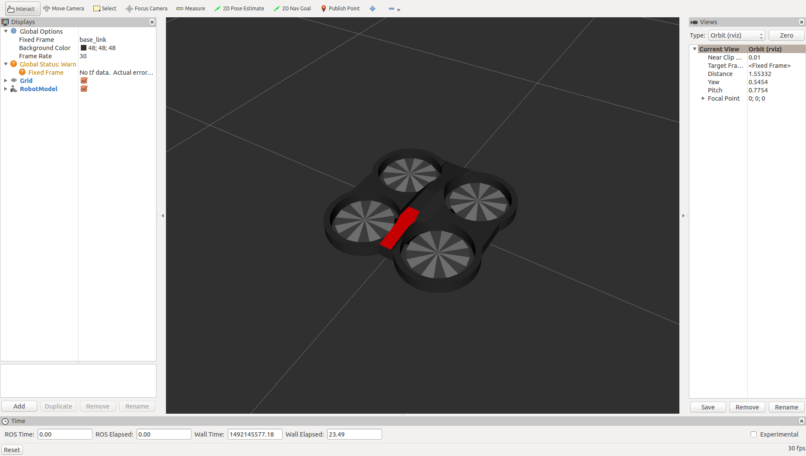
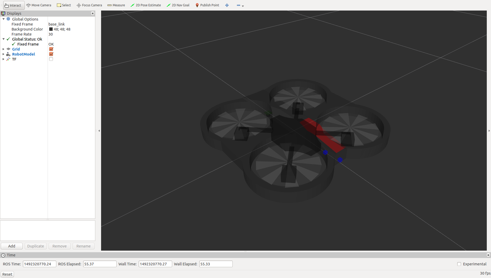
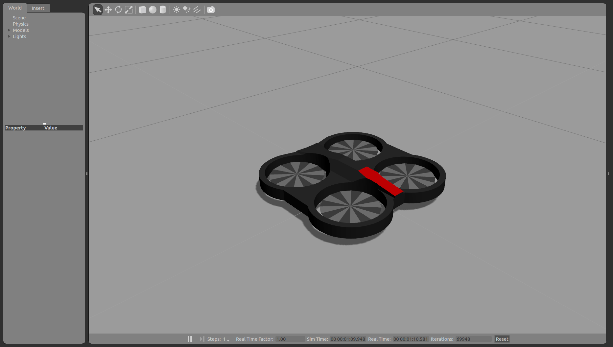
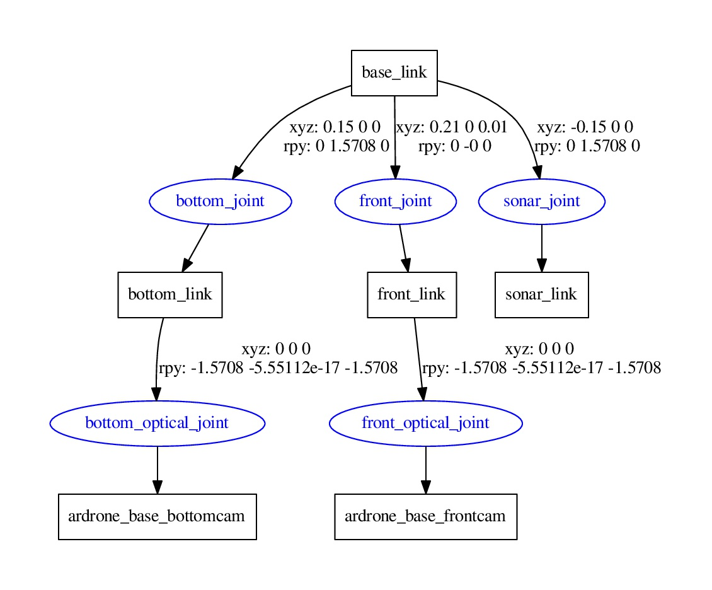

# ardroneを表示する

droneの種類は3つ
* droneのみ　　　　　　　　`quadrotor`
* drone＋センサ類　　　　　 `quadrotor_sensors`
* drone＋センサ類（PSD含む） `quadrotor_psd`

## rvizによる確認

* droneのみ
```bash
roslaunch cvg_sim_gazebo rviz.launch model:="`rospack find cvg_sim_gazebo`/urdf/quadrotor.urdf.xacro"
```
<div align="center">

</div>

* droneとセンサ類

```bash
roslaunch cvg_sim_gazebo rviz.launch model:="`rospack find cvg_sim_gazebo`/urdf/quadrotor_sensors.urdf.xacro"
```


<div align="center">

</div>

**このとき、`roscore`しているとGrobal Optionがエラーになる**

## gazeboによる確認

```bash
roslaunch cvg_sim_gazebo gazebo.launch model:="`rospack find cvg_sim_gazebo`/urdf/quadrotor.urdf.xacro"
```

<div align="center">

</div>

## xacro to urdf

```bash
rosrun xacro xacro.py quadrotor_sensors.urdf.xacro > quadrotor_sensors.urdf
```

## ツリーの確認

```bash
$ check_urdf quadrotor_sensors.urdf
robot name is: quadrotor_hokuyo_utm30lx
---------- Successfully Parsed XML ---------------
root Link: base_link has 3 child(ren)
    child(1):  bottom_link
        child(1):  ardrone_base_bottomcam
    child(2):  front_link
        child(1):  ardrone_base_frontcam
    child(3):  sonar_link

$ urdf_to_graphiz quadrotor_sensors.urdf
```

<div align="center">

</div>

##### 配信されているtfを表示する

```bash
rosrun tf view_frames
```